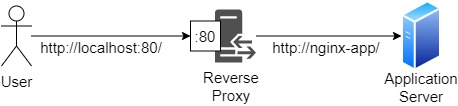

# Configure reverse proxy with NGINX

## Steps to reproduce

Run the following command. This will create the containers and run them from configuration in `docker-compose.yml`.

```
$ docker-compose up
Creating nginx-rp     ... done
Starting a1_nginx-app_1 ... done
Attaching to a1_nginx-app_1, nginx-rp
.
.
```

Line 5 of `docker-compose.yml` builds an image based on `Dockerfile` in current directory. This `Dockerfile` creates a simple NGINX reverse proxy based on `nginx.conf` file. `nginx.conf` is configured as reverse proxy by adding

```
location / {
  proxy_pass http://nginx-app;
}
```

The `Dockerfile` is simply written as shown below. The first line initialises a new Base Image. The second line modifies the image with the configuration we have created in `nginx.conf` (by copying this file into the filesystem of the container at the path specified.)

```
FROM nginx:latest
COPY ./nginx.conf /etc/nginx/conf.d/
```

To access the proxied servers (which is also a NGINX application), run

```
$ curl http://localhost:80/
<!DOCTYPE html>
<html>
<head>
<title>Welcome to nginx!</title>
<style>
html { color-scheme: light dark; }
body { width: 35em; margin: 0 auto;
font-family: Tahoma, Verdana, Arial, sans-serif; }
</style>
</head>
<body>
<h1>Welcome to nginx!</h1>
<p>If you see this page, the nginx web server is successfully installed and
working. Further configuration is required.</p>

<p>For online documentation and support please refer to
<a href="http://nginx.org/">nginx.org</a>.<br/>
Commercial support is available at
<a href="http://nginx.com/">nginx.com</a>.</p>

<p><em>Thank you for using nginx.</em></p>
</body>
</html>
```

The following diagram illustrates how the reverse proxy proxies the server.



